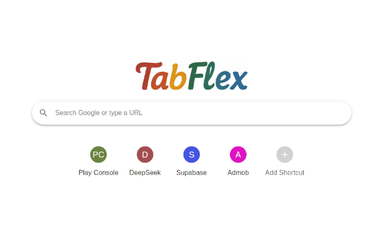
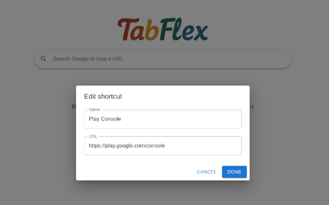

# TabFlex

**TabFlex** is a customizable and open-source new tab extension for Google Chrome.  
It's designed to replace the default Chrome New Tab page with something **more functional**, **more beautiful**, and **completely yours**.

---

## 🚀 Motivation

The default **New Tab** page in Chrome is clean, but limited. You can only access a few frequently visited sites, and there’s minimal room for personalization or productivity enhancements.

**TabFlex** was created to solve that.

> Our goal is to offer a more flexible, feature-rich alternative to Chrome's native new tab, while keeping it lightweight and user-friendly.

Unlike many alternatives, TabFlex is **open-source**, meaning anyone can contribute, customize, or fork the project to suit their own needs.

---

## 📸 Screenshots

**Customizable grid layout with links and icons:**

**Personalized background, icon styles, and more:**

---

## ✨ Features

- 🧩 Visual grid of favorite websites
- ✏️ Edit icons, titles, and links easily
- ⚡ Super lightweight and fast
- 🔒 Privacy-first: everything is stored locally

---

## 💡 Planned Improvements

Here's what we’re working on next:

- [ ] Custom backgrounds (images, colors, or solid themes)
- [ ] Light & Dark themes (system-aware)
- [ ] Drag-and-drop rearrangement
- [ ] Optional widgets (clock, to-do, weather, notes)
- [ ] Cloud sync (across devices)
- [ ] Time-based themes (e.g. dark at night)
- [ ] Folder or section grouping for icons
- [ ] Import/export config
- [ ] i18n (multi-language support)
- [ ] Accessibility enhancements
- [ ] Mobile browser support (if possible)

---

## 🧠 Built With

- ReactJs
- Mui-X

---

## 🤝 Contributing

We’d love your help! Whether it’s fixing a bug, improving performance, translating, or suggesting new features — contributions are welcome.

To contribute:

1. Fork the repository
2. Create a new branch: `git checkout -b feature/my-feature`
3. Commit your changes: `git commit -m 'Add my feature'`
4. Push to the branch: `git push origin feature/my-feature`
5. Open a Pull Request

For larger features, feel free to open an issue first so we can discuss it.

---

## 📄 License

This project is licensed under the **MIT License** – see the [LICENSE](./LICENSE) file for details.

---

## 🌐 Stay Connected

- 💬 Have suggestions or ideas? [Open an issue](https://github.com/antonioolf/tabflex-extension/issues)
- ⭐ Like the project? Star it to support!
- 🔗 Visit [TabFlex on Chrome Web Store](https://chrome.google.com/webstore/) _(coming soon)_

---

**TabFlex – your browser, your rules.**  
Open source. Lightweight. Fully yours.
